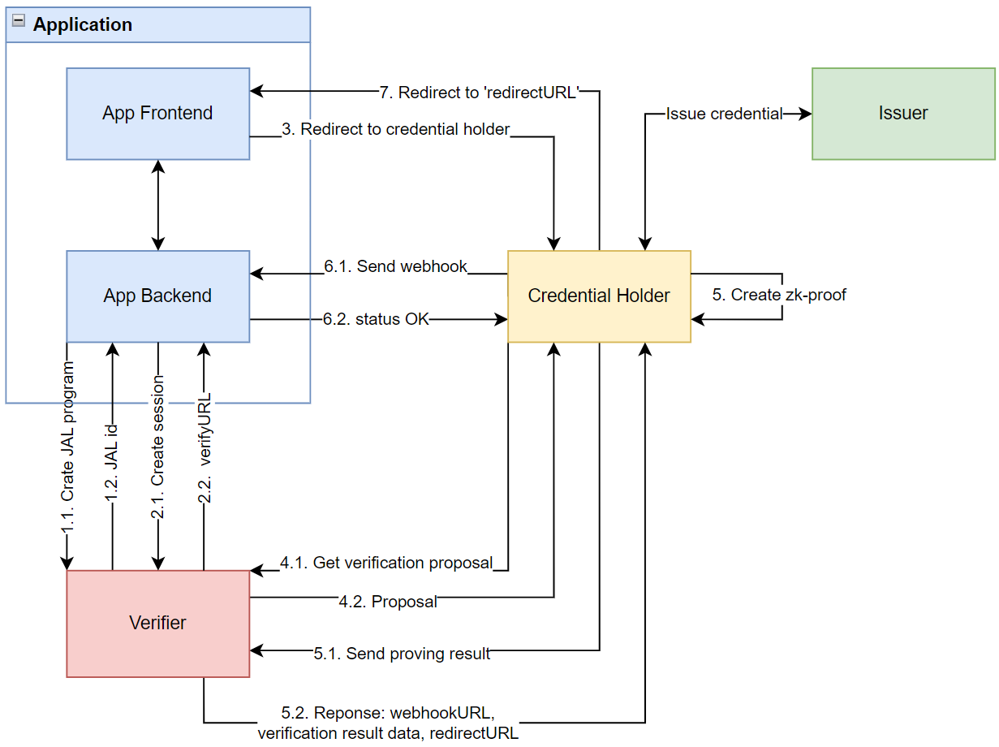

## ZCred Sybil-Center Verifier

The Sybil-Center Verifier is a zero-knowledge proof credential verifier. The verifier is one of the components involved
in the process of user verification. This verifier allows you to authenticate your users based on digital credentials
with zero-knowledge proof, ensuring that your users' personal data is highly protected since the user maintains full
control over the entire lifecycle of their credentials. To confirm any statement about themselves, the user does not
send the entire credential to the verifier, but only a zero-knowledge proof of the truth of that statement. The user's
actual data remains undisclosed.

### High-level architecture overview

This section outlines the high-level architecture of interactions between entities involved in the process of user
verification based on zero-knowledge credentials. Verification process includes following entities:

- `App Frontend` – Your frontend application that interacts with the user
- `App Backend` – Your server application
- `Credential Holder` – The browser application that manages zk-credentials and creates zk-proofs. This application is
  controlled by the user.
- `Issuer` – The application that issues a zk-credential to the Credential Holder.
- `Verifier` – The server application that initiates the verification process based on zero-knowledge credentials and
  verifies the correctness of the proof provided.

To start the user verification process, your `application` first needs to inform the `verifier` about the specific claim
the user must verify. The verification algorithm related to the user’s claim is described by a zk-program, which is
written using the special language `JAL` (JSON Abstract Language),
see [Create JAL program](#create-jal-program-zk-program) section. In response to the request for creating
a `zk-program` (`JAL program`), your application will receive an identifier for this program, which will be referred to
as `jalId`.

After creating the required program, described in `JAL`, for checking the claim, the next step is to initiate the user
verification session. How to start a verification session is described
in [Create verification session](#create-verification-session)
section. In response to the request for creating a session, your application will receive
a `verifyURL`, where the user needs to be redirected to complete the verification.

The verifyURL redirects the user to the `Credential Holder` application. The `Credential Holder` app requests
the `Proposal`
for verification from `Verifier`. Then, the user receives the necessary credential for verification from the `Issuer`,
if needed. Based on
the credential and the JAL program specified in the `Proposal`, the `Credential Holder` creates a `zk-proof`.

The created `zk-proof`, along with other information (`Proving result`), is sent to the `Verifier`. In response, the
`Credential Holder` receives information about where to send the webhook (`webhookURL`) and where to redirect the
user (`redirectURL`) after successful
verification and webhook submission.

After successfully sending the webhook, the user is redirected to the `redirectURL`. If an error occurs during the
webhook submission, the verification process will be considered unsuccessful, and the user will be notified of the
error. How to handle webhook see in [Handle webhook](#handle-webhook)

The diagram below depicts the described process.



### Identification and Authorization

To ensure that our verifier recognizes it is communicating with your application, we use identification based on the
secp256k1 public key and JWS (JSON Web Signature).

#### JWS header

JWS header MUST contain `alg` property with `"ES256K"` value.

```json
{
  "alg": "ES256K"
}
```

#### JWS payload

JWS payload MUST contain following list of properties:

- `exp` - Expiration time in UNIX time, e.g. `1726407291888`

- `aud` - verifier URL origin, e.g. `"https://verifier.sybil.center/"` or `"https://dev.verifier.sybil.center/"`

- `statement` - Description outlines the action that your application intends to perform.

    - `create-session` - create or initialize verification session
    - `create-jal` - create zk-program (JAL program)
    - `get-verification-result` - get verification result

- `jwk` - secp256k1 Json Web Key, which can be used to verify JWS. JWK example:

```json

{
  "x": "oCudX90TB8LuRlK6VNSS0f0Rp9G7PzpExKBeefGd6TM",
  "y": "kkqiWABplSsBQNiN4hw2fuSvfEqQbhSY8gq49i5MKSE",
  "kty": "EC",
  "crv": "secp256k1"
}

```

JWS payload example:

```json
{
  "exp": 1726407291888,
  "aud": "https://verifier.sybil.center/",
  "statement": "create-session",
  "jwk": {
    "x": "oCudX90TB8LuRlK6VNSS0f0Rp9G7PzpExKBeefGd6TM",
    "y": "kkqiWABplSsBQNiN4hw2fuSvfEqQbhSY8gq49i5MKSE",
    "kty": "EC",
    "crv": "secp256k1"
  }
}
```

#### Where to place the JWS ?

Set the JWS in the `Authorization` HTTP header as a Bearer token for each request to the verifier. For example:
`Bearer <jws>`.

### Create JAL program (zk-program)

To verify users using zero-knowledge credentials, the verifier first needs to set up a zk-program that will handle
the process of creating and verifying the proof. This zk-program is described using a special language
called [`JAL`](https://www.npmjs.com/package/o1js-jal) (JSON
Abstract Language). Since JAL is not developer-friendly, it is recommended to use JS
libraries ([`@jaljs/js-zcred`](https://www.npmjs.com/package/@jaljs/js-zcred),
[`@sybil-center/passport`](https://www.npmjs.com/package/@sybil-center/passport))
to create the required
zk-program.

#### JWS statement

Value of JWS payload `statement` MUST be `"create-jal-program"`

#### HTTP request and response

##### Method:

`POST`

##### Endpoint:

`https://verifier.sybil.center/api/v2/jal` or `https://dev.verifier.sybil.center/api/v2/jal` - for dev

##### Headers:

- `Authorization`: `Berear <JWS with 'create-jal-program' statement>`
- `Content-Type`: `application/json`

##### Request body:

Create JAL program request body is JSON object with following properties

- `jalProgram`: JSON object. Put JAL program here
- `comment`: string, human-readable comment for your user.
  For example: `You cannot pass verification if you are younger than 18 years old.`

##### Response body:

Response body is JSON object with following properties:

- `id`: string, unique JAL program identifier `jalId`

#### Create JAL program example

```typescript
import * as jose from "jose";
import { O1JS_ETH_DEV } from "@sybil-center/passport";
import { assert, not, toJAL } from "@jaljs/js-zcred";

async function createJalProgram(input: { config: Config, jwk: Es256kJwk }): Promise<string> {
  const jwk = await jose.importJWK(input.jwk);
  const jwt = await new jose.CompactSign(
    new TextEncoder().encode(JSON.stringify({
      exp: new Date(new Date().getTime() + 1000 * 10 * 60).getTime(),
      aud: input.config.verifierOrigin,
      statement: "create-jal-program",
      jwk: input.jwk
    }))
  ).setProtectedHeader({ alg: "ES256K" })
    .sign(jwk);
  const endpoint = new URL(`/api/v2/jal`, input.config.verifierOrigin);
  const {
    inputSchema: {
      credential,
      context
    },
    olderThanYears,
    youngerThanYears,
    fromCountry,
    genderIs
  } = O1JS_ETH_DEV;
  const attributes = credential.attributes;
  const jalProgram = toJAL({
    target: "o1js:zk-program.cjs",
    credential: credential,
    publicInput: [
      attributes.subject.id.type,
      attributes.subject.id.key,
      attributes.document.sybilId,
      context.now
    ],
    commands: [
      assert(olderThanYears(18)),
      assert(youngerThanYears(45)),
      assert(not(fromCountry("USA"))),
      assert(genderIs("male"))
    ],
    options: {
      signAlgorithm: "mina:pasta",
      hashAlgorithm: "mina:poseidon"
    }
  });
  const createJalResp = await fetch(endpoint, {
    method: "POST",
    headers: {
      "Authorization": `Bearer ${jwt}`,
      "Content-Type": "application/json"
    },
    body: JSON.stringify({
      comment: "Some comment",
      jalProgram: jalProgram,
    })
  });
  if (!createJalResp.ok) {
    throw new Error(`Can not create JAL program. Response body: ${await createJalResp.text()}`);
  }
  const { id } = await createJalResp.json() as { id: string };
  return id;
}
```

### Create verification session

To start verification process first of all you need to initialize session with verifier.
As a result you get `verifyURL` - url where you SHOULD redirect your user to start verification

#### JWS statement

Value of JWS payload `statement` MUST be `"create-session"`

#### HTTP request and response

##### Method:

`POST`

##### Endpoint:

`https://verifier.sybil.center/api/v2/verifier/${jalId}/session`

or `https://dev.verifier.sybil.center/api/v2/verifier/${jalId}/session` - for dev

`jalId` is JAL program identifier from [Create JAL program](#create-jal-program-zk-program) section.

##### Headers:

- `Authorization`: `"Berear <JWS with 'create-session' statemnt>"`
- `Content-Type`: `"application/json"`

##### Request body:

Request body is JSON object with following properties:

- `subject`: JSON object which contains:

    - `id`:  [ZCIP-2](https://github.com/zcred-org/ZCIPs/blob/main/ZCIPs/zcip-2.md) identifier of user. Example
      for `ethereum`:
    ```json
    {
      "type": "ethereum:address",
      "key": "0xb9Baa2979F62c806Ca3fE8f6932E82Bb416112aA" // user ethereum address
    }
    ```
- `webhookURL`:  `URL string` to your webhook endpoint
- `redirectURL`: `URL string` where user will be redirected after verification process
- `issuer`: JSON object with following properties:

    - `type`: string with value `http`
    - `uri`: `URI string` of issuer. For example: `https://issuer.sybil.center/issuers/passport`
      or `https://api.dev.sybil.center/issuers/passport`
    - `accessToken`: OPTIONAL string access token to get credential from issuer.
- `credentialHolderURL`: `URL string` of credential holder application. For example: `https://app.zcred.me`
  or `https://dev.app.zcred.me`

Request body example:

```json
{
  "subject": {
    "id": {
      "type": "ethereum:address",
      "key": "0xb9Baa2979F62c806Ca3fE8f6932E82Bb416112aA"
    }
  },
  "webhookURL": "https://your.backend.app.domain/webhook",
  "redirectURL": "https://your.frontend.app.domain/redirect-url",
  "issuer": {
    "type": "http",
    "uri": "https://issuer.sybil.center/issuers/passport"
  },
  "credentialHolderURL": "https://app.zcred.me"
}
```

##### Response body:

Response body is JSON object with following properties:

- `verifyURL`: `URL string`, for your user verification. Redirect user here.
- `sessionId`: string, verifier unique session id

Response body example:

```json
{
  "verifyURL": "https://dev.app.zcred.me/?proposalURL=https%3A%2F%2Fverifier.sybil.center%2Fapi%2Fv2%2Fverifier%2F36f4c3f940a7ce4a59ca153339bba38e8d34f297235199380bf0ae84831770c9%2Fproposal%3FsessionId%3DSV7jkCg68O_zLzIKUcj3C4JSfLGBrozfOAO93sP4hT4",
  "sessionId": "SV7jkCg68O_zLzIKUcj3C4JSfLGBrozfOAO93sP4hT4"
}
```

### Handle webhook

Your application can handle a webhook for user verification results. First, you need to specify the webhookURL in the
HTTP body of the session creation request. After that, a request containing user verification information will be sent
to this webhookURL. More detailed information about the webhook is provided below.

#### Webhook HTTP request

##### Method:

`POST`

##### Headers:

- `Authorization`: `Berear <detached JWS>`
- `Content-Type`: `application/json`

##### Request body:

Webhook HTTP request body is JSON object with following properties:

- `sessionId`: string, unique verifier session identifier
- `status`: string, `"success"` if verification done, `"exception"` if exception occurs
- `jalId`: string, jal program identifier
- `jalURL`: `string URL`, jal program URL
- `verificationResultId`: string, verification result unique identifier
- `verificationResultURL`: `string URL`, verification result url
- `result`: JSON object, properties depends on `status` value.

  **If** `status` is `exception`:

    - `code`: number, exception code
    - `message`: string, exception message

  **If** `status` is `success`:

    - `signature`: string, user signature verification agreement
    - `message`: string, agreement message
    - `proof`: string, zk-proof for verification
    - `verificationKey`: OPTIONAL string, verification key for zk-proof
    - `publicInput`: JSON object with following properties:
        - `credential`: JSON object with following mandatory properties:
            - `attributes`: JSON object. `attributes` properties depends on `JAL program` public input. Mandatory
              properties are described below:
                - `subject`: JSON object with following attributes:
                    - `id`: JSON object with following attributes:
                        - `type`: string, [ZCIP-2](https://github.com/zcred-org/ZCIPs/blob/main/ZCIPs/zcip-2.md)
                          identifier type, e.g. for ethereum: `ethereum:address`
                        - `key`: string, user public key or address, e.g. for
                          ethereum `0xb9Baa2979F62c806Ca3fE8f6932E82Bb416112aA`

#### Code example:

```typescript

fastify.post<{ Body: WebhookDto }>(webhookURLPath, {
  schema: { body: WebhookDto }
}, async (req, resp) => {
  if (!req.headers?.authorization) {
    resp.statusCode = 403;
    return { message: "Authorization header is not defined" };
  }
  const jws = req.headers.authorization.slice(7);
  const isBodyVerified = await isWebhookBodyVerified({ jws, body: req.body });
  if (!isBodyVerified) {
    resp.statusCode = 403;
    return { message: "Access denied" };
  }
  const result = req.body.result;
  if (req.body.status === "success" && Value.Check(ProvingResult, result)) {
    const subjectId = idToString(result.publicInput.credential.attributes.subject.id);
    verifiedStore[subjectId] = true;
    return { message: "ok" };
  }
  if (req.body.status === "exception") {
    return { message: "ok" };
  }
  resp.statusCode = 400;
  return { message: "Bad request" };
});


async function isWebhookBodyVerified(input: {
  jws: string;
  body: WebhookDto
}): Promise<boolean> {
  const detachedJWS = input.jws;
  const strPayload = JSON.stringify(sortKeys(input.body, { deep: true }));
  const jwsPayload = Buffer.from(new TextEncoder().encode(strPayload)).toString("base64url");
  const [head, _, signature] = detachedJWS.split(".");
  const jws = `${head}.${jwsPayload}.${signature}`;
  const jwsDecodedHeed: { kid: string } = JSON.parse(
    u8a.toString(u8a.fromString(head!, "base64url"))
  );
  const kidURL = new URL(jwsDecodedHeed.kid);
  if (kidURL.origin !== new URL(config.verifierOrigin).origin) {
    return false;
  }
  const jwkResp = await fetch(jwsDecodedHeed.kid);
  if (!jwkResp.ok) {
    throw new Error("Can not get verifier JWK");
  }
  const jwk = await jwkResp.json() as Es256kJwk;
  try {
    await jose.compactVerify(jws, await jose.importJWK(jwk));
    return true;
  } catch (e) {
    return false;
  }
}
```

### Get verification result

You can get all verifications results from verifier.

#### JWS statement

Value of JWS payload `statement` MUST be `"create-session"`

#### Get verification result HTTP request

##### Method:

`POST`

##### endpoint:

`https://verifier.sybil.center/api/v2/verification-result/page?index=${pageIndex}&size=${pageSize}`

or

`https://dev.verifier.sybil.center/api/v2/verification-result/page?index=${pageIndex}&size=${pageSize}` for dev

Endpoint contains search parameters: `index` - index of page and `size` - elements counts in page

##### Headers:

- `Authorization`: `"Berear <JWS with 'get-verification-result' statemnt>"`
- `Content-Type`: `"applicatoin/json"`

##### Request body:

Request body is JSON object with following properties:

- `id`: OPTIONAL string, verification result id
- `jalId`: OPTIONAL string, jal program id
- `subjectId`: OPTIONAL JSON object with following properties:
    - `type`: string, [ZCIP-2](https://github.com/zcred-org/ZCIPs/blob/main/ZCIPs/zcip-2.md) identifier type
    - `key`: string, user public key or address according
      to [ZCIP-2](https://github.com/zcred-org/ZCIPs/blob/main/ZCIPs/zcip-2.md) identifier key
- `status`: OPTIONAL string, verification result status - `"success"` or `"exception"`

##### Response body:

Response body is JSON object with following properties:

- `currentIndex`: number, current page index
- `prevIndex`: number or null, previous page index
- `nextIndex`: number or null, next page index
- `count`: number, pages count
- `recordsCount`: number, pages count
- `result`: JSON array, each element is JSON object with following properties:
    - `id`: string, verification result identifier
    - `status`: string, value `success` or `exception`
    - `clientId`: JSON object with following properties:
        - `type`: string, [ZCIP-2](https://github.com/zcred-org/ZCIPs/blob/main/ZCIPs/zcip-2.md) identifier type
        - `key`: string, client (your app) public key or address according
          to [ZCIP-2](https://github.com/zcred-org/ZCIPs/blob/main/ZCIPs/zcip-2.md) identifier key
    - `subjectId`: JSON object with following properties:
        - `type`: string, [ZCIP-2](https://github.com/zcred-org/ZCIPs/blob/main/ZCIPs/zcip-2.md) identifier type
        - `key`: string, user public key or address according
          to [ZCIP-2](https://github.com/zcred-org/ZCIPs/blob/main/ZCIPs/zcip-2.md) identifier key
    - `createdAt`: `ISO date-time string`, verification result creation date & time
    - `jalId`: string, JAL program identifier
    - `data`: JSON object with following properties:
        - `exception`: OPTIONAL JSON object. Defined when `status` is `exception`. JSON contains following properties:
            - `message`: OPTIONAL string, exception message
            - `code`: number, exception code
        - `provingResult`: JSON object. Defined when `status` is `success`. JSON contains following properties:
            - `signature`: string, user signature verification agreement
            - `message`: string, agreement message
            - `proof`: string, zk-proof for verification
            - `verificationKey`: OPTIONAL string, verification key for zk-proof
            - `publicInput`: JSON object with following properties:
                - `credential`: JSON object with following mandatory properties:
                    - `attributes`: JSON object. `attributes` properties depends on `JAL program` public input.
                      Mandatory properties are described below:
                        - `subject`: JSON object with following attributes:
                            - `id`: JSON object with following attributes:
                                - `type`: string, [ZCIP-2](https://github.com/zcred-org/ZCIPs/blob/main/ZCIPs/zcip-2.md)
                                  identifier type, e.g. for ethereum: `ethereum:address`
                                - `key`: string, user public key or address, e.g. for
                                  ethereum `0xb9Baa2979F62c806Ca3fE8f6932E82Bb416112aA`

### Application implementation example

- Simple application implementation example repository: https://github.com/zcred-org/third-app

### Demo

https://dev.app.zcred.me/

### Credential Holder URLs

- https://dev.app.zcred.me: Dev `Credential holder` browser application

### Issuers URLs

- https://issuer.sybil.center/issuers/passport: Prod passport `Issuer` server application
- https://dev.issuer.sybil.center/issuers/passport: Dev passport `Issuer` server application

### Swagger documentation

- Production: https://verifier.sybil.center/documentation/static/index.html
- Development: https://dev.verifier.sybil.center/documentation/static/index.html